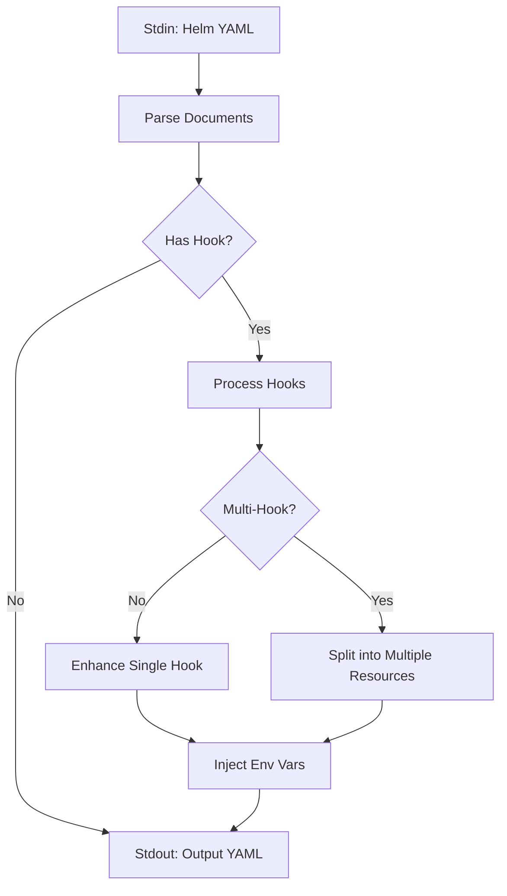

# Design Document

## Overview
**helm-hooks** is an **Advanced Hook Manager** for Helm. It solves the limitation where Helm applies a single weight to all hooks in a resource. It intercepts Helm's rendered YAML, splits multi-hook resources into individual definitions, and injects precise weights and context.

## Logic Flow

## Core Features

1. **Multi-Hook Splitting**: Automatically splits one resource (e.g., `Job`) into multiple variations for different hook events.
2. **Per-Hook Weights**: Assign specific weights like `pre-install=-10, post-install=20`.
3. **Context Injection**: Injects `HELM_HOOK_EVENT` and `HELM_HOOK_WEIGHT` so the container knows which lifecycle hook triggered it.

## Naming Strategy
When splitting resources, we prevent name collisions by appending the hook event:
- `migration-job` + `pre-install` → `migration-job-pre-install`

## Weight Precedence
1. `helm.sh/hook-weights` (Highest)
2. `helm.sh/hook-weight` (Native Helm)
3. Default: 0
